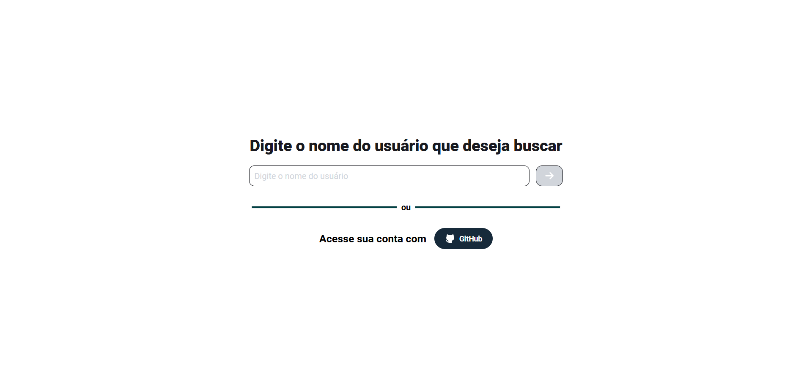
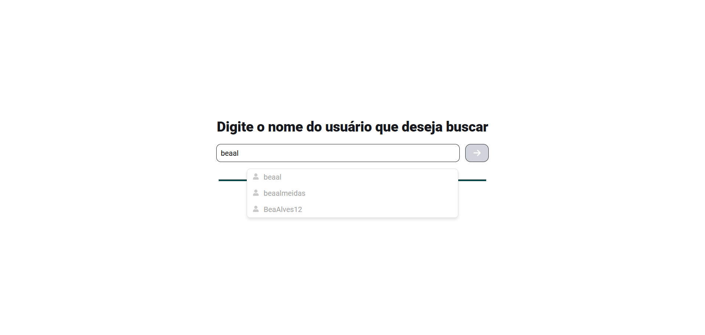
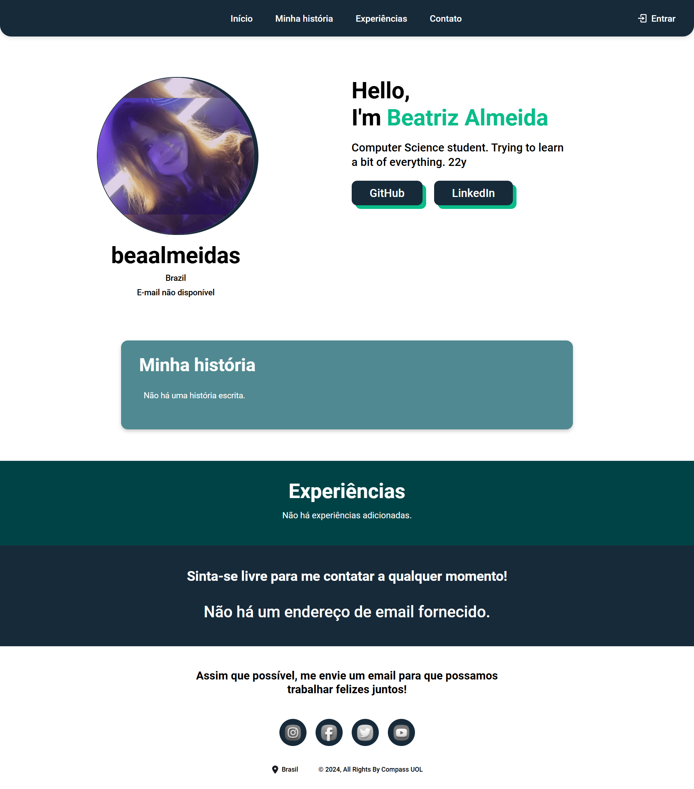

# Personal Portfolio – Compass UOL 🧭

O projeto foi desenvolvido como o 3° desafio do Programa de Bolsas Compass UOL. Trata-se de um portfólio profissional que permite ao usuário visualizar e editar suas informações de portfólio, com autenticação via Firebase e GitHub e integração com a API pública do GitHub. Desenvolvido em React com TypeScript, testes unitários e deploy na AWS EC2.


**EN:** 
The project was developed as the 3rd challenge of the Compass UOL Scholarship Program. It is a professional portfolio that allows users to view and edit their portfolio information, with authentication via Firebase and GitHub and integration with the GitHub public API. Developed in React with TypeScript, unit tests, and deployed on AWS EC2.

---

## Componentes / Components
- **Tela Inicial**: Permite o log-in usando a conta do GitHub ou a busca de um usuário pelo nome de usuário.
- **Tela de Portfólio**: Exibe o portfólio do usuário.

**EN:**
- **Home Screen**: Allows login using the GitHub account or searching for a user by username.
- **Portfolio Screen**: Displays the user's portfolio.

---

#### Avisos
Por causa de restrições de tempo, alguns objetivos não foram alcançados:
- Implementação da possibilidade de inserção de cards de Experiência
- Implementação da possibilidade de edição do link do botão do LinkedIn
- Adição de testes unitários

---

## Como usar / How to run

#### AWS EC2
O aplicativo está disponível no endereço público da instância EC2. Basta acessar a URL abaixo:

[3.17.129.142](3.17.129.142)

Não é necessário configurar nada localmente para visualizar o aplicativo, pois ele já está rodando no ambiente da AWS EC2.
Caso você deseje rodar o aplicativo localmente para desenvolvimento, siga as etapas abaixo:

**EN:**
The application is available at the public IP address of the EC2 instance. Simply access the URL below:

[3.17.129.142](3.17.129.142)

No local setup is required to view the application, as it is already running in the AWS EC2 environment.
If you would like to run the application locally for development purposes, follow the steps below:


#### Rodando localmente / Running locally

**PRÉ-REQUISITOS / PRE-REQUISITES:**
- Node.js
<br>

**1. Clone este repositório / Clone the repository:**

   ```bash
   git clone https://github.com/beaalmeidas/desafio-03-aws-react.git
```

**2. Abra o diretório / Open the directory:**

   ```bash
   cd desafio-03-aws-react
```

**3. Instale as dependências / Install the dependencies:**

   ```bash
   npm install
```

**4. Inicie o server / Start the server:**

   ```bash
   npm start
```
O aplicativo estará disponível em / The application will be running on: http://localhost:3000.

---

## Capturas de tela / Screenshots

<table>
  <tr>
    <td></td>
    <td></td>
  </tr>
  <tr>
    <td></td>
    <td></td>
  </tr>
</table>

<br>

---

### Autora / Author
Beatriz Almeida de Souza Silva <br>
November 2024